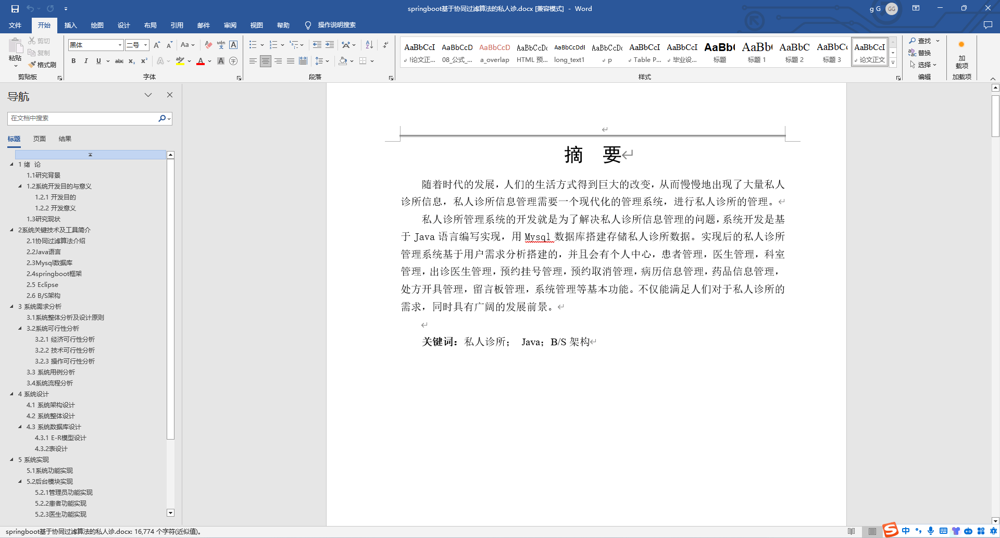
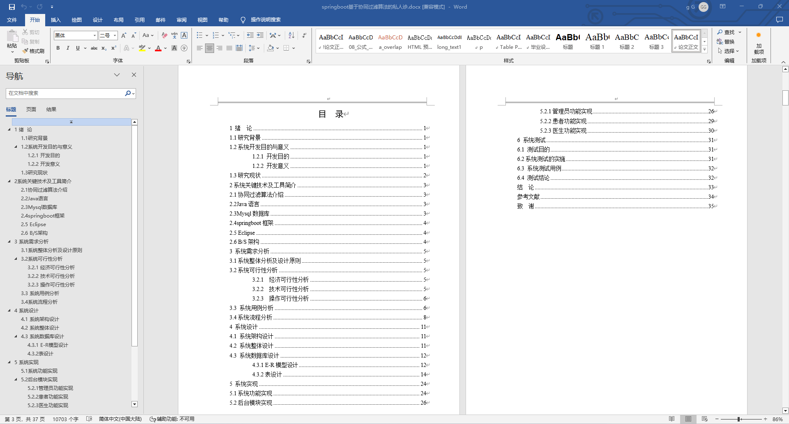
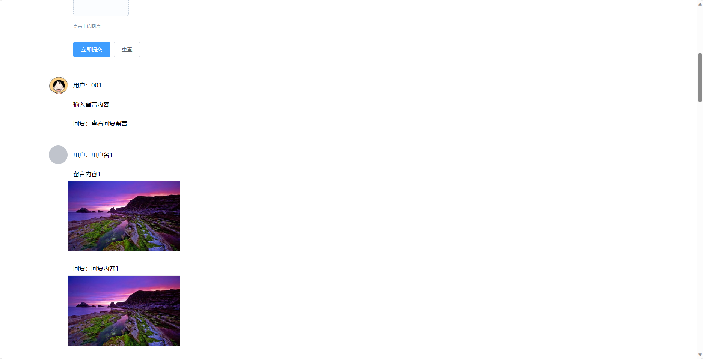
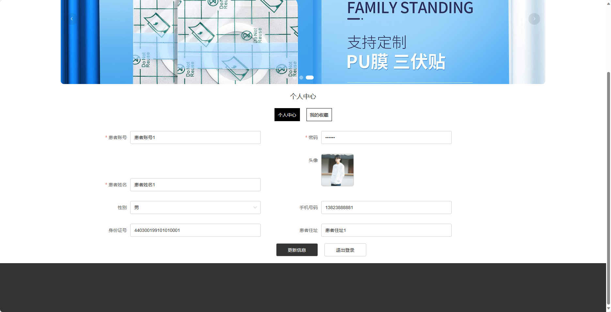
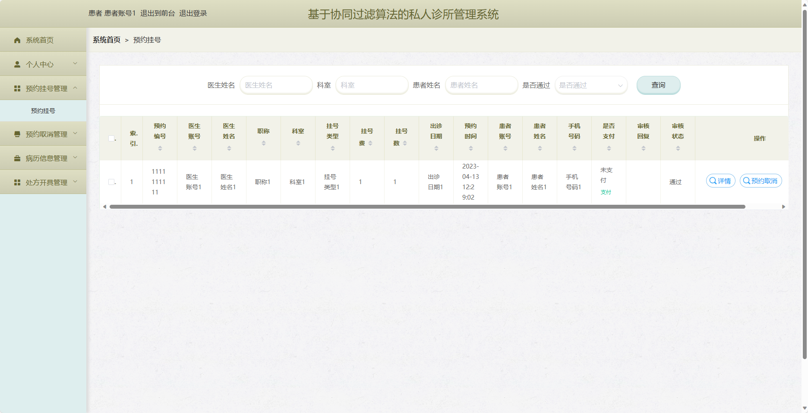
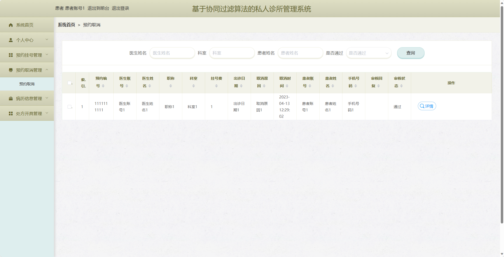
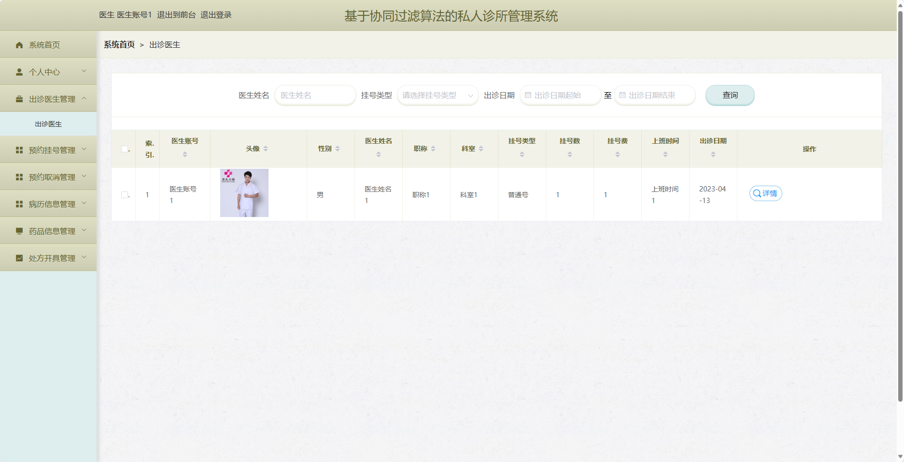
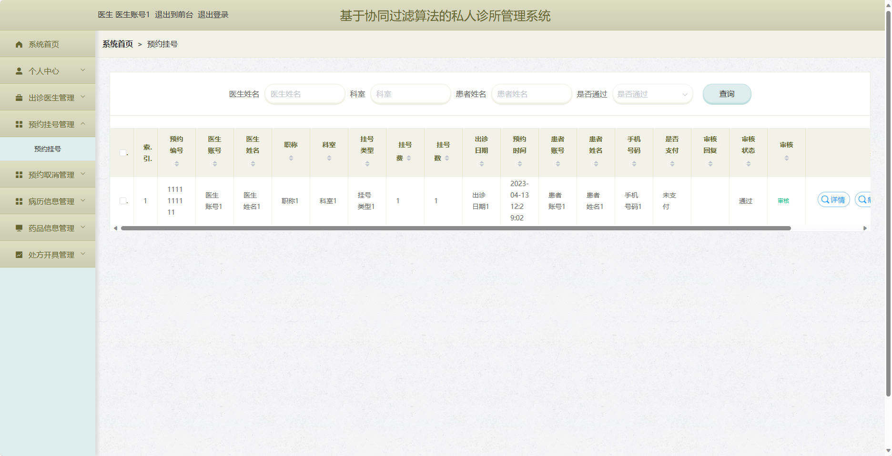

基于SpringBoot的私人诊所管理系统（程序+论文）
=
- 完整代码获取地址：从戎源码网 ([https://armycodes.com/](https://armycodes.com/))
- 作者微信：19941326836  QQ：952045282 
- 承接计算机毕业设计、Java毕业设计、Python毕业设计、深度学习、机器学习
- 选题+开题报告+任务书+程序定制+安装调试+论文+答辩ppt 一条龙服务
- 所有选题地址https://github.com/nature924/allProject

一、项目介绍
---
基于Spring Boot框架实现的私人诊所管理系统，系统包含两种角色：管理员、用户,系统分为前台和后台两大模块，主要功能如下。

### 前台：

1. 首页：展示私人诊所的概览信息。
2. 出诊医生：展示当前出诊的医生列表和他们的专业领域。
3. 公告信息：提供私人诊所的最新公告和通知信息。
4. 留言板：用户可以在留言板上留下咨询或建议。
5. 个人中心：用户可以管理个人信息，包括修改密码、查看预约记录等操作。

### 后台：

### 管理员：
1. 个人中心：管理员可以管理个人信息，包括修改密码等操作。
2. 患者管理：管理员可以管理患者信息，包括查看患者列表、添加、编辑、删除等操作。
3. 医生管理：管理员可以管理医生信息，包括查看医生列表、添加、编辑、删除等操作。
4. 科室管理：管理员可以管理科室信息，包括添加、编辑、删除等操作。
5. 出诊医生管理：管理员可以管理医生的出诊信息，包括添加、编辑、删除等操作。
6. 预约挂号管理：管理员可以管理患者的预约挂号信息，包括审核、取消等操作。
7. 预约取消管理：管理员可以处理患者的预约取消申请。
8. 病历信息管理：管理员可以查看和管理患者的病历信息。
9. 药品信息管理：管理员可以管理药品信息，包括添加、编辑、删除等操作。
10. 处方开具管理：管理员可以管理医生开具的处方信息，包括查看、审核等操作。
11. 留言板管理：管理员可以管理留言板上的留言信息，包括回复、删除等操作。
12. 系统管理：管理员可以管理系统的参数设置、日志查看等功能。

### 用户：
1. 个人中心：用户可以管理个人信息，包括修改密码等操作。
2. 预约挂号管理：用户可以预约挂号并查看自己的预约记录。
3. 预约取消管理：用户可以申请取消预约，并查看取消申请的状态。
4. 病历信息管理：用户可以查看和管理自己的病历信息。
5. 处方开具管理：用户可以查看医生开具的处方信息，并进行取药相关操作。

### 医生：
1. 个人中心：医生可以管理个人信息，包括修改密码等操作。
2. 出诊医生管理：医生可以管理自己的出诊信息，包括添加、编辑、删除等操作。
3. 预约挂号管理：医生可以查看患者的预约挂号信息，并进行处理和确认。
4. 预约取消管理：医生可以查看患者的预约取消申请，并进行处理。
5. 病历信息管理：医生可以查看和管理患者的病历信息。
6. 药品信息管理：医生可以查看和管理药品信息。
7. 处方开具管理：医生可以开具处方给患者。

二、项目技术
---
- 编程语言：Java
- 数据库：MySQL
- 项目管理工具：Maven
- 前端技术：VUE、HTML、Jquery、Bootstrap
- 后端技术：Spring、SpringMVC、MyBatis

三、运行环境
---
- 操作系统：Windows、macOS都可以
- JDK版本：JDK1.8以上都可以
- 开发工具：IDEA、Ecplise、Myecplise都可以
- 数据库: MySQL5.7以上都可以
- Tomcat：任意版本都可以
- Maven：任意版本都可以

四、运行截图
---
### 论文截图：

### 程序截图：

